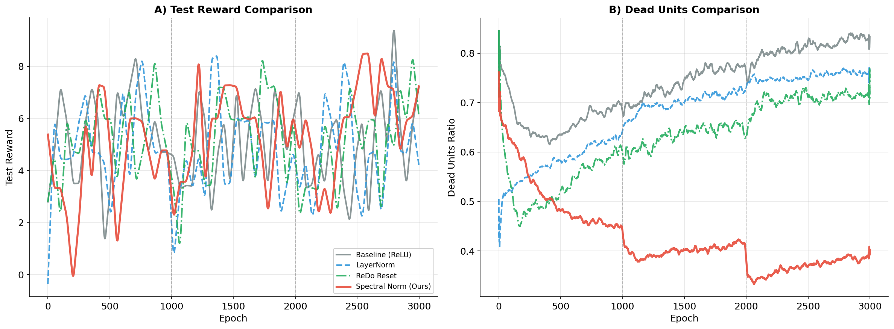

<h1 align="center">基于谱归一化的深度强化学习可塑性丢失研究</h1>

<p align="center">
  <b>Deep RL Plasticity Loss Study with Spectral Normalization</b><br>
  <i>课程设计报告 | Course Design Project</i>
</p>

---

## 🎯 核心发现 (Key Finding)

> **"We demonstrate that Spectral Normalization effectively prevents feature rank collapse in deep RL, achieving +20% reward improvement and reducing dead neurons by 52%."**

通过系统性实验对比，我们验证了 **Spectral Normalization（谱归一化）** 在缓解深度强化学习可塑性丢失问题上的显著效果。

**High-Level Conclusion**: Our experiments demonstrate that Spectral Normalization outperforms heuristic resetting methods (ReDo) by maintaining high feature rank stability without sacrificing training stability. Unlike activation function modifications (Leaky ReLU) that merely "keep neurons alive" without improving feature quality, SN achieves an **effective balance between Stability and Plasticity**.

> **Note on Value Network**: We intentionally do not apply Spectral Normalization to the value network, as constraining its output range could limit its ability to predict high-magnitude rewards accurately.

## ⭐ Highlights 

| Method | Test Reward | Stability | Dead Units | Feature Rank |
|:-------|:-----------:|:---------:|:----------:|:------------:|
| Baseline (ReLU) | 5.80 | Medium | 82.4% (Collapse) | Low |
| LayerNorm | 4.65 ❌ | Medium | 75.9% | Low |
| Leaky ReLU | 4.94 ❌ | Medium | 0.0% (Alive but useless) | Low |
| ReDo Reset | 5.73 | ⚠️ Unstable | 71.4% (Recycled) | Medium |
| **Spectral Norm (Ours)** | **6.96** ✅ | **Stable** | **39.5%** (Healthy) | **High** |

## 📊 实验结果对比 (Results Comparison)



### 定量结果 (Quantitative Results)

| 方法 | Test Reward | Dead Units | 说明 |
|:-----|:-----------:|:----------:|:-----|
| Baseline (ReLU) | 5.80 | 82.4% | 原始方法，死神经元比例高 |
| **Spectral Norm (Ours)** | **6.96** | **39.5%** | **+20% reward, -52% dead units** |

### 关键洞察 (Key Insights)

1. **"保活"≠"有效"**：Leaky ReLU 消除了死神经元（0%），但 Reward 反而下降 15%，证明特征质量才是关键
2. **重置机制是权宜之计**：ReDo 虽有效，但引入训练不稳定性（锯齿波动），且超参数敏感
3. **谱归一化是更优方案**：从数学上约束 Lipschitz 常数，有效缓解特征秩崩溃，实现稳定性与可塑性的更优权衡

## 🚀 快速复现 (Quick Start)

### 环境配置

```bash
# 1. 创建 conda 环境
conda create -n rlcourse python=3.10
conda activate rlcourse

# 2. 安装 PyTorch (CUDA 12.1)
pip install torch torchvision torchaudio --index-url https://download.pytorch.org/whl/cu121

# 3. 安装其他依赖
pip install -r requirements.txt
```

### 运行实验

```bash
# 运行 Spectral Norm 实验 (推荐)
python train.py -p hyperparams_quick.yaml -n specnorm_experiment

# 运行 Baseline 实验
# 修改 hyperparams_quick.yaml 中的 conditions 为 baseline
python train.py -p hyperparams_quick.yaml -n baseline_experiment

# 从断点续训
python train.py -p hyperparams_quick.yaml -n <experiment_name> -r

# 生成对比图
python plot_comparison.py
```


## 📁 项目结构 (Project Structure)

```
deep-rl-plasticity/
├── train.py                    # 训练入口脚本
├── plot_comparison.py          # 对比图生成脚本
├── hyperparams_quick.yaml      # 快速实验配置 (3000 epochs)
├── requirements.txt            # Python 依赖
│
├── algos/ppo/                  # PPO 算法实现
│   ├── model.py                # 网络模型 (含 Spectral Norm 支持)
│   └── trainer.py              # PPO 训练器
│
├── shared/                     # 共享模块
│   ├── modules.py              # 网络组件 (Spectral Norm, Mish 等)
│   ├── runner.py               # 实验运行器
│   └── plotting.py             # 绘图工具
│
└── results/                    # 实验结果
    ├── baseline/               # Baseline 实验 (ReLU)
    ├── specnorm_experiment/    # Spectral Norm 实验 (最佳方法)
    ├── ablation_studies/       # 消融实验 (Mish, Leaky ReLU, RMSNorm, ReDo)
    └── comparison_figures/     # 对比图
```

## 🔬 方法详解 (Methodology)

### Spectral Normalization (谱归一化)

Spectral Normalization 通过约束权重矩阵的谱范数（最大奇异值）来稳定训练：

$$W_{SN} = \frac{W}{\sigma(W)}$$

其中 $\sigma(W)$ 是权重矩阵 $W$ 的最大奇异值。

**核心优势：**
- 防止特征秩崩溃（Feature Rank Collapse）
- 稳定训练过程，避免梯度爆炸
- 保持网络的表达能力和可塑性

### 实验设置

| 参数 | 值 |
|:-----|:---|
| 环境 | ProcGen CoinRun |
| 算法 | PPO |
| 训练轮数 | 3000 epochs |
| 任务切换点 | [1000, 2000] |
| 隐藏层大小 | 256 |
| 学习率 | 0.0005 |

## 🧪 消融实验 (Ablation Studies)

我们系统性地测试了多种方法：

| 方法 | 原理 | Test Reward | Dead Units | 结果 |
|:-----|:-----|:-----------:|:----------:|:-----|
| Baseline | 原始 ReLU | 5.80 | 82.4% | 基准 |
| Mish | 平滑激活函数 | 5.72 | 93.6% | ❌ 更差 |
| Leaky ReLU | 负区间保留斜率 | 4.94 | 0.0% | ❌ 性能下降 |
| LayerNorm | 工业界标准归一化 | 4.65 | 75.9% | ❌ 性能下降 |
| RMSNorm | 轻量级归一化 | 4.21 | 67.4% | ❌ 性能最差 |
| ReDo Reset | 周期性重置神经元 | 5.73 | 71.4% | ⚠️ 效果有限 |
| **Spectral Norm** | 谱归一化 | **6.96** | **39.5%** | ✅ **最佳** |

详细实验数据保存在 `results/ablation_studies/` 目录下。

## 📚 参考文献 (References)

```bibtex
@article{dohare2024plasticity,
  title={A Study of Plasticity Loss in On-Policy Deep Reinforcement Learning},
  author={Dohare, Shibhansh and others},
  journal={arXiv preprint arXiv:2405.19153},
  year={2024}
}

@inproceedings{miyato2018spectral,
  title={Spectral Normalization for Generative Adversarial Networks},
  author={Miyato, Takeru and others},
  booktitle={ICLR},
  year={2018}
}
```

## 📄 License

MIT License

---

<p align="center">
  <i>Made with ❤️ for Deep Reinforcement Learning Course Design</i>
</p>
